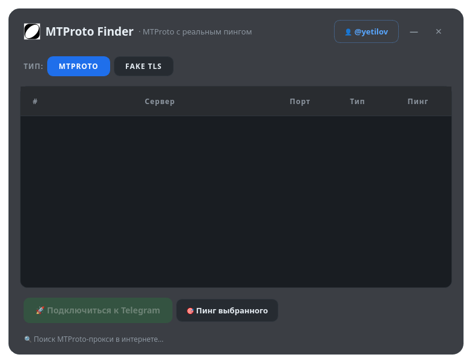

# ⚡ MTProto Finder

[](https://t.me/yetilov)
[](LICENSE)

Графическое приложение для **Linux**, которое автоматически находит рабочие
MTProto-прокси для Telegram в интернете и показывает их **реальный пинг от вашей сети**
в режиме реального времени. Современный полупрозрачный интерфейс без рамки окна.



## Возможности

- 🔍 **Автоматический поиск** прокси в интернете (публичные списки, обновление каждые 10 минут)
- 📶 **Реальный TCP-пинг** от сети пользователя, параллельно, таблица заполняется по мере проверки
- 🏆 Топ-10 самых быстрых серверов с цветовой индикацией пинга (зелёный / жёлтый / красный)
- 🔀 Переключатель **MTPROTO | FAKE TLS** — фильтр по типу прокси
- 🎯 **«Пинг выбранного»** — пингует только выбранный сервер, останавливая остальные
- 🚀 Подключение в один клик (двойной клик или Enter) — прокси подставляется в Telegram
- 🌙 Прозрачное безрамочное окно со скруглениями, перетаскивание за заголовок
- 📦 Поставляется как **AppImage** — без установки

## Установка и запуск

```bash
chmod +x MTProto-Finder-x86_64.AppImage
./MTProto-Finder-x86_64.AppImage
```

Требования: Linux x86_64 с FUSE2 (`sudo pacman -S fuse2` на Arch Linux).
Для прозрачности нужен композитор (KDE, GNOME, Hyprland — работают из коробки).

Приложение само следит за интернетом: если связи нет, поиск повторяется каждые 15 секунд.

## Сборка из исходников

```bash
./build.sh
```

Нужны: `python-pyqt6`, `fuse2`, `appimagetool` (или путь к нему в `$APPIMAGETOOL`).
Также есть автосборка через GitHub Actions — AppImage прикладывается к релизу.

## Источники прокси

Открытые авто-обновляемые списки:
[ALIILAPRO/MTProtoProxy](https://github.com/ALIILAPRO/MTProtoProxy) и
[Argh94/Proxy-List](https://github.com/Argh94/Proxy-List).

## Автор

**@yetilov** — [https://t.me/yetilov](https://t.me/yetilov)

## Лицензия

[MIT](LICENSE)
