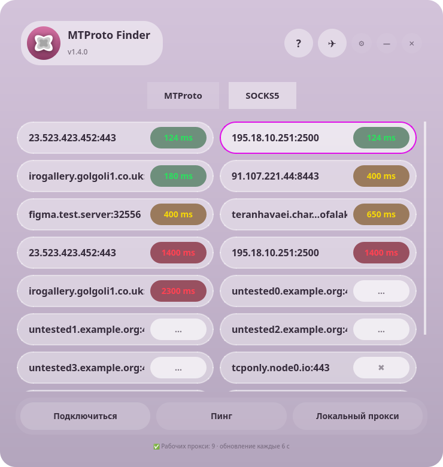

# ⚡ MTProto Finder

[](https://t.me/miiko3)
[](LICENSE)
[](../../releases/latest)
[](https://boosty.to/miilo3)

Приложение, которое само находит в интернете **рабочие прокси для Telegram** —
MTProto и SOCKS5 — и показывает их **настоящий пинг из вашей сети**.
Никаких фейковых «1 мс»: сервер получает цветной бейдж только после успешного
рукопожатия с ним.

| Тёмная тема | Светлая тема |
|---|---|
|  |  |

## Скачать

Готовые сборки — в разделе [Releases](../../releases/latest):

| Файл | Для |
|---|---|
| `MTProto-Finder-x86_64.AppImage` | Linux x86_64, запуск без установки |
| `MTProto-Finder-v0.1.3.5b.apk` | Android 8+ |
| `MTProtoFinder.ipa` | iPhone (iOS 26+), unsigned — для Sideloadly/AltStore |

```bash
chmod +x MTProto-Finder-x86_64.AppImage
./MTProto-Finder-x86_64.AppImage
```

Нужен только FUSE2 (`sudo pacman -S fuse2` на Arch / `sudo apt install libfuse2` на Debian/Ubuntu).

## Как это работает

- **Поиск** — приложение тянет 15 открытых авто-обновляемых списков прокси
  (7 MTProto + 8 SOCKS5), всё параллельно, через CDN-зеркала jsDelivr.
- **Проверка** — по каждому серверу делается полноценное рукопожатие:
  - MTProto: реальный запрос `req_pq_multi` и ответ от Telegram-DC;
  - FakeTLS: полный MTProto-протокол (`req_pq_multi` → `ResPQ`) внутри TLS-туннеля по SNI, зашитому в секрет;
  - SOCKS5: полный CONNECT-запрос через прокси.
- **Бейджи пинга**: 🟢 до 300 мс · 🟡 до 1000 мс · 🔴 выше.
  Серый `✖` — TCP отвечает, но MTProto не работает: в Telegram такой
  прокси не подключится. Серый `—` — сервер мёртв. Рабочие всегда сверху.

## Возможности

- 🔀 Два типа прокси: **MTProto | SOCKS5**
- 🃏 Карточки в две колонки, до 32 серверов, пинг пересчитывается каждые 6 секунд
- 🎯 Режим «Пинг» — пингует только выбранный сервер
- 🚀 Подключение в один клик: двойной клик по карточке, Enter или кнопка «Подключиться» — прокси открывается в Telegram
- 📋 Контекстное меню карточки: подключиться, скопировать ссылку или адрес; на Android — долгий тап
- ⌨ Менюбар с горячими клавишами: `Ctrl+1/2` — тип прокси, `F5` — обновить, `Ctrl+,` — настройки, `F1` — справка
- 🧊 Графитовый glass-интерфейс в цвет иконки: безрамочное окно, тёмная тема, синий акцент, blur-стекло
- 🔌 **Локальный прокси** — поднимает MTProto-мост на `127.0.0.1:10811` через лучший найденный сервер; работает и с FakeTLS-прокси (нативный TLS, record-обёртка) и с WebSocket-режимом напрямую в Telegram (kws1-3.web.telegram.org:443); на Linux и iOS — один и тот же алгоритм
- 🚙 Автозапуск при входе в систему (`./install_autostart.sh`)
- 📴 Сам следит за интернетом: пропала сеть — пересканирует через 15 секунд

## Сборка из исходников

```bash
./build.sh
```

Нужны: `python-pyqt6`, `pycryptodome`, `fuse2`, `appimagetool`
(путь к нему можно передать через `$APPIMAGETOOL`).

Android-сборка: `android/build_android.sh`, iOS-проект лежит в `ios/`.

## Источники прокси

Открытые GitHub-списки, обновляются их владельцами круглосуточно
(в приложении грузятся через зеркала `cdn.jsdelivr.net`):

MTProto: [ALIILAPRO/MTProtoProxy](https://github.com/ALIILAPRO/MTProtoProxy),
[Argh94/Proxy-List](https://github.com/Argh94/Proxy-List),
[MhdiTaheri/ProxyCollector](https://github.com/MhdiTaheri/ProxyCollector),
[SoliSpirit/mtproto](https://github.com/SoliSpirit/mtproto),
[Chumbayoumba/free-telegram-proxy-russia-2026](https://github.com/Chumbayoumba/free-telegram-proxy-russia-2026),
[horizonpaz-create/mtproto-live](https://github.com/horizonpaz-create/mtproto-live)

SOCKS5: [monosans/proxy-list](https://github.com/monosans/proxy-list),
[TheSpeedX/PROXY-List](https://github.com/TheSpeedX/PROXY-List),
[proxifly/free-proxy-list](https://github.com/proxifly/free-proxy-list),
[roosterkid/openproxylist](https://github.com/roosterkid/openproxylist),
[zloi-user/hideip.me](https://github.com/zloi-user/hideip.me),
[casals-ar/proxy-list](https://github.com/casals-ar/proxy-list),
[ShiftyTR/Proxy-List](https://github.com/ShiftyTR/Proxy-List),
[Argh94/Proxy-List](https://github.com/Argh94/Proxy-List)

Бесплатные списки живут своей жизнью: часть серверов умирает за часы,
поэтому приложение перепроверяет всё само и показывает только то,
что отвечает прямо сейчас.

## Платформы

| Платформа | Версия | Статус |
|---|---|---|
| Linux (AppImage) | 1.4.3 | ✅ стабильная |
| Android (APK) | 0.1.3.5b | 🧪 бета |
| iOS (SwiftUI, Liquid Glass) | 1.0.3 | 🧪 бета, сборка unsigned через GitHub Actions |

## Что нового в 1.4.6 (iOS 1.0.3)

- 🏗 **Локальный прокси починен**: в релее клиентский поток теперь повторно
  шифруется под секрет сервера-апстрима (`encU`) — раньше на апстрим уходил
  расшифрованный поток, и туннель не работал. Выравнивание AES-CTR подтверждено
  свежей реализацией Telethon (`tcpmtproxy`/`tcpobfuscated`): заголовок шифруется
  всеми 64 байтами, поток продолжается ровно с той же позиции.
- 🕹 **Отдельная вкладка «Локальный»** — туннель вынесен из списка прокси в
  собственную вкладку с инструкцией и статусом реле.
- 🧊 **Стекло по всему UI**: полупрозрачные материалы вместо непрозрачных
  заливок (акцентные капсулы, выбор режима), глянцевый блик на карточках —
  как в Liquid Glass iOS 26.
- 📱 **Адаптивная сетка**: 1/2/3 колонки по доступной ширине (SE → Pro Max →
  iPad), весь контент в скролле — ничего не обрезается на маленьких экранах.
- 🖼 **Иконка и лого**: `Assets.xcassets` наконец подключён к сборке
  (Resources-фаза) — AppIcon теперь реально попадает в .ipa; лого дублируется
  в шапке приложения.
- 📶 **Пинг SOCKS5 честнее**: метрика = задержка клиент→прокси (ответ на
  приветствие), живучесть — по успешному CONNECT.

## Что нового в 1.4.5 (iOS 1.0.2)

- 🚇 **Локальный туннель на iOS** — порт Linux-моста `localproxy.py` на Swift:
  приложение поднимает настоящий MTProto-прокси на `127.0.0.1:10811` с
  секретом `dd…dd`. В Telegram добавляете
  `tg://proxy?server=127.0.0.1&port=10811&secret=dd…dd` — и вся связь идёт
  через лучший проверенный приложением сервер.
- 🔄 **Три режима реле** для туннеля: обычный MTProto, FakeTLS (полный TLS-туннель
  по SNI из секрета; реальное рукопожатие `req_pq_multi` → `ResPQ`) и честный
  fallback с посылкой `ClientHello` + обёрткой в TLS-records — тот же алгоритм,
  что в Linux-версии.
- 🌐 **WebSocket-режим**: если рабочих серверов нет, туннель автоматически
  ходит в Telegram напрямую через `kws1-3.web.telegram.org:443` (WSS,
  собственный мини-клиент WebSocket на Network.framework) — приложение
  остаётся полезным даже при блокировках.
- ✔ **Самопроверка шифра**: при старте AES-CTR / derive / framing / wrap-strip
  сверяются с эталонными векторами PyCryptodome (тем, что использует
  локальный мост) — в шапке появляется щит: 🛡 если рукопожатие совместимо
  с реальными MTProto-прокси.
- 🎛 **Карточка «Локальный туннель»** в стиле остального стеклянного UI:
  PowerButton с пульсом, живой бейдж LIVE, строки Адрес/Секрет (тап открывает
  весь `dd…dd`), кнопки «Ссылка tg://» (копирование) и «В Telegram».

## Что нового в 1.4.4 (iOS 1.0.1)

- 🎨 **Интерфейс в цвет иконки**: палитра извлечена из `Frame 30.png`
  (графитовый монохром), UI перекрашен в серое стекло + синий акцент
  `#0A84FF`; AppIcon приложения заменён на `Frame 30.png`.
- 🧊 **Liquid Glass как в iOS 26**: максимальные скругления-пиллы, усиленный
  blur, графитовый фон с дрейфующими шарами, плавающий стеклянный док.
- 🎛 **Отдельные кнопки MTProto | SOCKS5** с пружинной анимацией нажатия
  (масштаб/свечение); активный тип — залитая акцентом капсула.
- 📐 **Адаптивный макет**: на iPad — центрированная колонка ~640pt и сетка
  в 3 колонки, на iPhone — 2 колонки.
- 🔒 **Честный пинг FakeTLS на iOS**: ee-прокси теперь проверяются полным
  MTProto-рукопожатием (`req_pq_multi` → `ResPQ`) **внутри** TLS-туннеля по
  SNI из секрета. Раньше «живым» числился любой TLS-сервер — такие прокси
  отображались с пингом, но в Telegram были недоступны.
- 🏷 Версия приложения iOS — **1.0.1**.

## Что нового в 1.4.3

- 🛠 **Честный пинг MTProto**: обычные (не FakeTLS) прокси теперь проверяются
  реальным рукопожатием `req_pq_multi` → `ResPQ` (obfuscated2, AES-CTR),
  а не «верой» в ответ TCP. Раньше такие серверы могли показываться
  рабочими, но не подключаться в Telegram.
- 🔍 **Исправлен пинг FakeTLS**: рабочим считается только прокси, который
  ответил настоящим MTProto-ответом внутри TLS-туннеля; убран shortcut,
  из-за которого «живыми» числились любые TLS-серверы.
- 🤝 **Локальный прокси стал надёжнее**: мост на `127.0.0.1:10811` теперь
  на каждое подключение сам подбирает лучший проверенный MTProto-сервер,
  а не замораживает первый на момент запуска; переживает смерть лучшего.
- 🌊 **iOS 26 (Liquid Glass)**: `glassEffect(.regular)`, `buttonStyle(.glass/.glassProminent)`,
  живой aurora-фон, морфинг переключателя MTProto|SOCKS5, плавающий
  стеклянный док. Deployment target поднят до iOS 26, версия приложения — 1.0.0.
- 🏭 **Готовые `.ipa` через GitHub Actions**: пуш тега `v*` автоматически
  собирает unsigned `.ipa` (Xcode 26, macOS runner) и крепит его к Release —
  подпишите локально через Sideloadly/AltStore и ставьте на iPhone.
- 📄 Подробный ревью изменений — в описании коммита `v1.4.3`.

## Поддержать

Если приложение помогло — можно поддержать разработку на Boosty:
**[boosty.to/miilo3](https://boosty.to/miilo3)**

## Автор

**@miiko3** — [t.me/miiko3](https://t.me/miiko3)

## Лицензия

[MIT](LICENSE)
