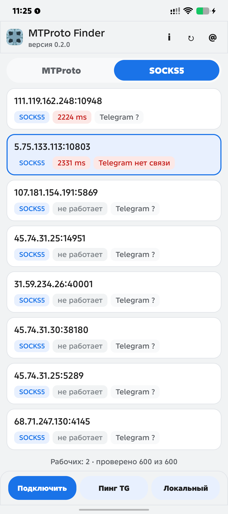

# ⚡ MTProto Finder

[](https://t.me/miiko3)
[](LICENSE)
[](../../releases/latest)
[](https://boosty.to/miilo3)

Приложение, которое само находит в интернете **рабочие прокси для Telegram** —
MTProto и SOCKS5 — и показывает **настоящий пинг из вашей сети**, включая
отдельный замер задержки **до самого Telegram**. Никаких фейковых «1 мс»: цветной
бейдж сервер получает только после успешного рукопожатия.

| Android (APK) | **0.2.1** |

| Android 0.2.1 |
|---|
|  |

## Что нового в 0.2.1

### 🔌 Локальный прокси больше не требует именно MTProto

Кнопка «Локальный» отказывала, если не находился рабочий **MTProto**-сервер, и
говорила «Нет рабочего MTProto» — даже когда рядом были живые SOCKS5. Причина
была в двух местах: мост жёстко отбрасывал любой апстрим, кроме MTProto
(`if (p == null || !"mtproto".equals(p.proto))`), и выбор сервера фильтровал
только MTProto. Поскольку публичные MTProto-списки сейчас почти полностью
мёртвые, кнопка была нерабочей практически всегда.

Теперь мост умеет и SOCKS5-апстрим: Telegram к локальному порту всегда
приходит по MTProto, а дальше мост сам открывает туннель — к MTProxy напрямую
или через SOCKS5 CONNECT на **настоящий адрес DC**, который выбрал клиент, и
перешифровывает поток под собственный апстримный заголовок.

### 📶 Пинг SOCKS5 теперь совпадает с тем, что показывает Telegram

Замер для SOCKS5 просил прокси соединиться **с самим собой** (`CONNECT` на
собственный адрес). Этот круг по интернету целиком попадал в измерение, и число
выходило в разы завышенным: пользовательский замер 1500+ мс против 505 мс,
которые показывал сам Telegram на том же прокси.

Теперь SOCKS5 меряется ровно так же, как это сделает Telegram: CONNECT на
настоящий адрес DC плюс обмен `req_pq_multi → ResPQ` внутри туннеля. Побочный
эффект правильный: «рабочим» теперь становится только тот прокси, через который
Telegram действительно отвечает.

### 🐛 Молчаливый отказ моста

`new ServerSocket(...)` бросал исключение, которое проглатывалось, — кнопка
выглядела как «ничего не делает». Теперь причина попадает в лог, а кнопка
проверяет фактический bind и показывает ошибку, если порт занят.

### 🔧 Мелочи

- `fetch()` больше не кастует соединение к `HttpsURLConnection`: обычный `http://`
  источник ронял весь список целиком.
- Для замера задержки через SOCKS5 используется фиксированный секрет вместо
  случайного — на задержку не влияет, но замер воспроизводим.

Проверено сквозным тестом: поддельный DC и SOCKS5-сервер на ПК, соединённые с
устройством через `adb forward/reverse`. Клиент говорит с мостом как Telegram,
мост поднимает SOCK5-туннель к настоящему адресу DC и перешифровывает поток —
`android/tools/bridge_harness.py`.

## Что нового в 0.2.0 (Android)

Полностью переработана Android-версия. Ниже — по пунктам, что было не так и
как исправлено.

### 🐛 Пинг больше не пропадал

Главная жалоба: «пинг не отображается». Причина была не в сети, а в логике:

- **Перечитывание источников стирало все результаты.** Каждый перескан делал
  `all = новыйСписок`, и все уже измеренные задержки обнулялись. Сканирование
  повторялось каждые 30 секунд, пока не найдётся «рабочий» прокси, — список
  бесконечно показывал «проверяю…». Теперь состояние переносится на новые
  объекты по ключу `протокол|host:port`.
- **Перескан больше не привязан к «нет рабочих».** Раньше отсутствие результата
  вызывало повторный скан через 30 секунд, что и замыкало круг. Теперь
  перечитывание списков идёт по своему расписанию, а статус честно показывает
  прогресс: «Проверено 207 из 600…».
- **Цикл перепинга вообще не запускался.** `repingRun` стартовал только при
  выключении ручного режима, которого в новом интерфейсе нет. После первой
  проверки пинг замирал навсегда.
- **Проверялись сразу все 39 тысяч найденных прокси.** Очередь в пуле растягивала
  обновление списка на десятки секунд, а флаг `pingBusy` сбрасывался задачей,
  стоявшей в конце этой же очереди. Теперь проверка идёт партиями по 128 из
  перемешанной выборки в 600, с корректным освобождением флага.

### 🎯 Появился настоящий «пинг в Telegram»

Прежний бейдж показывал задержку **до порта прокси** — это не то, что вы
почувствуете в мессенджере. Новая кнопка **«Пинг TG»** поднимает туннель до
настоящего DC Telegram и меряет полный обмен `req_pq_multi → ResPQ`:

- **MTProto** — рукопожатие с конкретным DC по секрету прокси;
- **FakeTLS** — то же самое внутри TLS-туннеля по SNI из секрета;
- **SOCKS5** — полный CONNECT на реальный адрес DC и обмен внутри туннеля.

Проверяются все пять DC, в бейдж идёт лучший результат. Если ни один не
ответил — честное «Telegram нет связи», а не выдуманное число. **При выборе
прокси смотрите на этот бейдж, а не на пинг до порта.**

### 🧩 Больше нет прокси с «хорошим» пингом, которые не работают

- **FakeTLS больше не проходит проверку по TLS-флайту.** Раньше для секретов
  вида `ee…` достаточно было, чтобы сервер ответил на ClientHello байтами
  `0x16 0x03` — то есть зелёный бейдж получал **любой** TLS-порт. Теперь
  требуется настоящий `ResPQ` внутри TLS-туннеля.
- **Серый бейдж больше не врёт.** Для «порта живого, но протокол не проходит»
  показывается «не работает», а не заманчивое «2 ms» — раньше это выглядело
  как отличный пинг и провоцировало попытку подключиться.
- **Локальный мост больше не замораживает один сервер.** Он заново перебирает
  живые MTProto на каждом подключении. Раньше выбранный прокси фиксировался в
  момент нажатия, и после его смерти локальный прокси не поднимался вообще.

### 📡 Источники: 15 → 45, и больше одного хоста

Все 15 источников шли через **единственный** хост `cdn.jsdelivr.net`. Когда он
недоступен (обычная ситуация), приложение находило ровно **ноль** прокси и
показывало пустой список без единого бейджа. Добавлены:

- прямые зеркала `raw.githubusercontent.com` — независимый хост с другими IP;
- 4 Telegram-специфичных сборки MTProto (раньше FakeTLS-прокси почти не попадали
  в выборку — сейчас `FakeTLS` это 86 % списка);
- 9 новых живых списков SOCKS5;
- заголовки-комментарии в списках корректно пропускаются.

Суммарно на скриншоте выше — **44 469** адресов, из них проверяется репрезентативная
выборка 600.

### 🎨 Интерфейс в стиле Google

Плоско, монотонно, без теней и градиентов — как в системных приложениях Google:

- один синий акцент `#1A73E8` в цвет логотипа, серые контейнеры по ролям;
- карточки с волосяной линией, `stateListAnimator = null` — система не добавляет
  анимацию подъёма;
- верхняя и нижняя панели — полупрозрачные и лежат **поверх** списка, у страницы
  ровно такие же отступы, поэтому контент никогда не перекрывается и не прыгает;
- одна колонка на телефоне: раньше две колонки обрезали имя хоста до четырёх
  символов («guar…»), и прокси было невозможно опознать;
- все подписи в одну строку, без переносов.

### 🧹 Разное

- Новый логотип (иконка приложения во всех плотностях + адаптивная иконка).
- Версия в шапке, обновлённый текст «О пинге» с объяснением, что означает
  каждый бейдж.
- Кнопка «↻» перечитывает списки по требованию.
- Сборка Android больше не требует Linux: добавлен `android/build_android.ps1`
  (Windows) рядом с `build_android.sh`.

## Скачать

Готовые сборки — в разделе [Releases](../../releases/latest):

| Файл | Для |
|---|---|
| `MTProto-Finder-x86_64.AppImage` | Linux x86_64, запуск без установки |
| `MTProto-Finder-v0.2.1.apk` | Android 8+ |
| `MTProtoFinder.ipa` | iPhone (iOS 26+), unsigned — для Sideloadly/AltStore |

```bash
chmod +x MTProto-Finder-x86_64.AppImage
./MTProto-Finder-x86_64.AppImage
```

Нужен только FUSE2 (`sudo pacman -S fuse2` на Arch / `sudo apt install libfuse2` на Debian/Ubuntu).

## Как это работает

- **Поиск** — приложение тянет 45 открытых авто-обновляемых списков прокси
  (11 MTProto + 19 SOCKS5 + зеркала), всё параллельно.
- **Проверка** — по каждому серверу делается полноценное рукопожатие:
  - MTProto: реальный запрос `req_pq_multi` и ответ `ResPQ` от Telegram-DC;
  - FakeTLS: полный MTProto-протокол внутри TLS-туннеля по SNI из секрета;
  - SOCKS5: полный CONNECT-запрос через прокси.
- **Бейджи**:
  - `NNN ms` — работает; зелёный до 300 мс, жёлтый до 1000 мс, красный выше;
  - `не работает` — порт отвечает, но протокол не проходит, в Telegram не подключится;
  - `недоступен` — сервер мёртв;
  - `Telegram NN ms` — реальная задержка до DC через этот прокси;
  - `Telegram нет связи` — прокси жив, но до Telegram не дотянулись.
- Рабочие всегда сверху, отсортированы по задержке.

## Возможности

- 🔀 Два типа прокси: **MTProto | SOCKS5**
- 🎯 Отдельный замер пинга **до Telegram** по всем пяти DC
- 🚀 Подключение в один клик: тап по карточке и «Подключить» — прокси открывается в Telegram
- 📋 Контекстное меню карточки (долгий тап): подключиться, проверить пинг в Telegram, перемерить, скопировать ссылку или адрес
- 🔌 **Локальный прокси** — MTProto-мост на `127.0.0.1:10811` через лучший найденный сервер, переподбирается на каждом подключении
- 📴 Сам следит за интернетом: пропала сеть — пересканирует через 15 секунд

## Сборка из исходников

```bash
./build.sh                      # Linux AppImage
./android/build_android.sh      # Android (Linux/macOS)
pwsh -File android/build_android.ps1   # Android (Windows)
```

Нужны: `python-pyqt6`, `pycryptodome`, `fuse2`, `appimagetool`
(путь к нему можно передать через `$APPIMAGETOOL`).
Для Android: JDK 17 и Android SDK build-tools 34.

## Источники прокси

Открытые GitHub-списки, обновляются их владельцами круглосуточно:

**MTProto** — [ALIILAPRO/MTProtoProxy](https://github.com/ALIILAPRO/MTProtoProxy),
[Argh94/Proxy-List](https://github.com/Argh94/Proxy-List),
[MhdiTaheri/ProxyCollector](https://github.com/MhdiTaheri/ProxyCollector),
[SoliSpirit/mtproto](https://github.com/SoliSpirit/mtproto),
[Chumbayoumba/free-telegram-proxy-russia-2026](https://github.com/Chumbayoumba/free-telegram-proxy-russia-2026),
[horizonpaz-create/mtproto-live](https://github.com/horizonpaz-create/mtproto-live),
[tgmtproxy/telegram-mtproto-proxy-list](https://github.com/tgmtproxy/telegram-mtproto-proxy-list),
[kort0881/telegram-proxy-collector](https://github.com/kort0881/telegram-proxy-collector),
[Argh94/telegram-proxy-scraper](https://github.com/Argh94/telegram-proxy-scraper)

**SOCKS5** — [monosans/proxy-list](https://github.com/monosans/proxy-list),
[TheSpeedX/PROXY-List](https://github.com/TheSpeedX/PROXY-List),
[proxifly/free-proxy-list](https://github.com/proxifly/free-proxy-list),
[roosterkid/openproxylist](https://github.com/roosterkid/openproxylist),
[zloi-user/hideip.me](https://github.com/zloi-user/hideip.me),
[casals-ar/proxy-list](https://github.com/casals-ar/proxy-list),
[ShiftyTR/Proxy-List](https://github.com/ShiftyTR/Proxy-List),
[hookzof/socks5_list](https://github.com/hookzof/socks5_list),
[ProxyScrape/free-proxy-list](https://github.com/ProxyScrape/free-proxy-list),
[ALIILAPRO/Proxy](https://github.com/ALIILAPRO/Proxy),
[hproxy-com/free-proxy-list](https://github.com/hproxy-com/free-proxy-list),
[VPSLabCloud/VPSLab-Free-Proxy-List](https://github.com/VPSLabCloud/VPSLab-Free-Proxy-List),
[iplocate/free-proxy-list](https://github.com/iplocate/free-proxy-list),
[Zaeem20/FREE_PROXIES_LIST](https://github.com/Zaeem20/FREE_PROXIES_LIST),
[Vann-Dev/proxy-list](https://github.com/Vann-Dev/proxy-list),
[sunny9577/proxy-scraper](https://github.com/sunny9577/proxy-scraper)

Бесплатные списки живут своей жизнью: часть серверов умирает за часы, поэтому
приложение перепроверяет всё само и показывает только то, что отвечает прямо
сейчас. Если список бейджей пуст — почти наверняка недоступен сам список
источников: включите VPN и нажмите «↻».

## Платформы

| Платформа | Версия | Статус |
|---|---|---|
| Linux (AppImage) | 1.4.3 | ✅ стабильная |
| Android (APK) | 0.2.1 | ✅ рабочая |
| iOS (SwiftUI, Liquid Glass) | 1.0.8 | 🧪 бета, сборка unsigned через GitHub Actions |

## Поддержать

Если приложение помогло — можно поддержать разработку на Boosty:
**[boosty.to/miilo3](https://boosty.to/miilo3)**

## Автор

**@miiko3** — t.me/miiko3

## Лицензия

[MIT](LICENSE)
